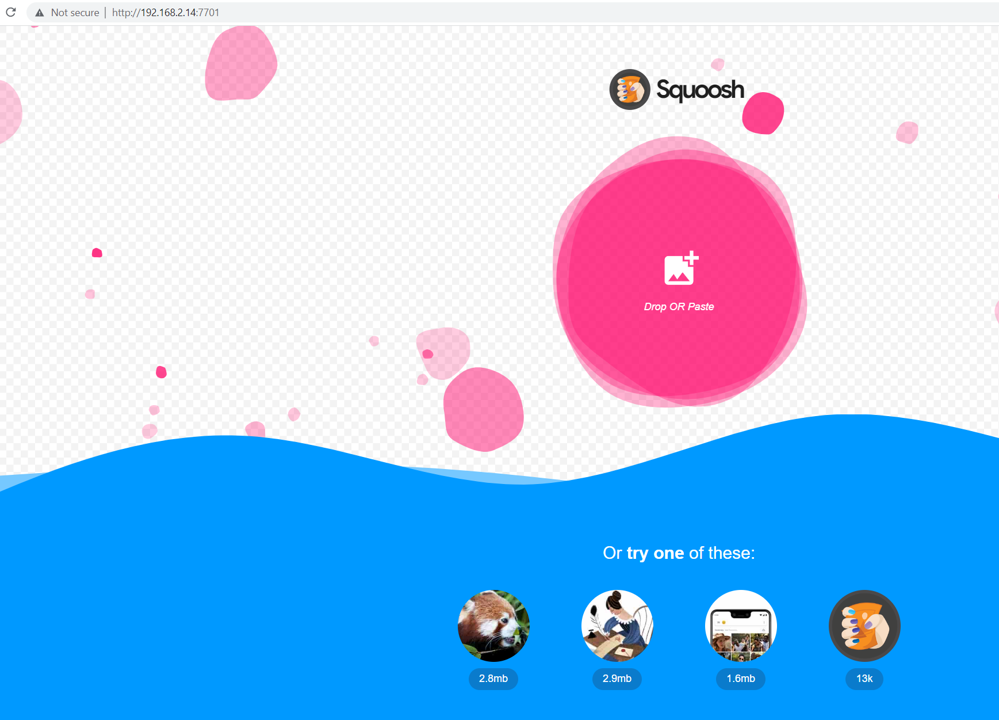

# squoosh

A https://github.com/GoogleChromeLabs/squoosh docker image. Support amd64, arm64 and arm v7 arch. Dockerfile open source at https://github.com/hellodk34/squoosh . If you appreciate for my work, you can leave a star on this GitHub repo, thank you as the same.

Docker Hub address: https://hub.docker.com/r/dko0/squoosh

## Other description

using docker buildx built

```
# docker buildx build -f ./Dockerfile -t NAMESPACE/squoosh:1.12.0 --platform=linux/arm64,linux/amd64,linux/arm/v7 .
```

My repo not contained all the source code, I just edited the package.json file and built this docker image. To review the source code, please step to [GoogleChromeLabs/squoosh](https://github.com/GoogleChromeLabs/squoosh) . Thanks for your using.

## Usage

### just docker run

```
# docker run -d --name squoosh \
    --restart unless-stopped \
    -p 7701:8080 \
    dko0/squoosh:1.12.0
```

then, visit http://YOUR_IP:7701 and enjoy it!

### docker-compose

```
cat > squoosh-compose.yml <<EOF
version: '3'
services:
  squoosh:
    image: dko0/squoosh:1.12.0
    container_name: squoosh
    networks:
      - squoosh-net
    ports:
      - 7701:8080
    restart: unless-stopped
networks:
  squoosh-net:
EOF
```

and then, just type `docker-compose -f ./squoosh-compose.yml up -d` and enter that it works!



### squoosh-cli usage

read this [article](https://hellodk.cn/post/1141) .

## Thanks

- https://github.com/GoogleChromeLabs/squoosh
- https://www.npmjs.com/package/@squoosh/cli
